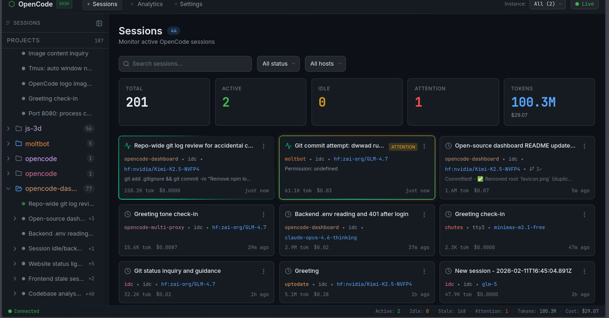

# OpenCode Dashboard



A way to keep up with multiple agents on multiple projects across multiple systems at the same time.

## How It Works

1. Install the OpenCode plugin on each machine you want to monitor
2. Plugin sends all events to a central backend server
3. Backend displays everything on a live, real-time web dashboard
4. Since it's just a plugin, you can run it on as many systems as you want — all pointing to the same backend
5. shows you exactly which session is idle via a yellow border glow or which session needs permission or which session is running via a green spinning animation 

> Real-time monitoring dashboard for OpenCode AI coding sessions across multiple VPS instances.

> **Coming soon:** npm package, dedicated plugin registry, and Docker Hub image. For now, install manually via docker compose and cp plugin to plugin dir od opencode 

## Architecture

```
OpenCode Plugin → POST /events → Backend (Bun + Hono + SQLite)
                                        ↓
                                  WebSocket Broadcast
                                        ↓
                        Frontend (Svelte 5 SPA) ← ws://.../ws
```

Single Bun process serves everything: API + WebSocket + static frontend — all on one port.

## Quick Start (Docker)

### 1. Set environment variables

```bash
export API_KEY="your-plugin-api-key"            # plugin authenticates with this
export FRONTEND_PASSWORD="your-dashboard-password"  # dashboard login password
```

### 2. Build and run

```bash
docker compose up -d
```

Dashboard is now live at `http://localhost:3000`

### 3. Rebuild after code changes

```bash
docker compose up -d --build
```

Docker layer caching ensures only changed layers rebuild — deps are cached, only the vite build + source copy runs fresh.

### 4. Stop

```bash
docker compose down
```

### Environment Variables

| Variable | Where | Description |
|---|---|---|
| `API_KEY` | runtime | Plugin → webhook auth (`X-API-Key` header on `/events`) |
| `FRONTEND_PASSWORD` | runtime | Dashboard login → stored in browser localStorage, sent as `X-API-Key` on API calls + WS auth |
| `BACKEND_PORT` | runtime | Host port mapping (default: `3000`) |
| `DATABASE_URL` | runtime | SQLite path (default: `./data/database.db`) |
| `DISABLE_TTS` | runtime | Set `true` to skip TTS model loading (default in Docker) not quite ready . so should disbale for now |

**No build-time secrets.** All env vars are runtime — change them and `docker compose up -d` to apply, no rebuild needed.

### Data Persistence

SQLite database is bind-mounted from `./backend/data/` on the host to `/app/backend/data/` in the container. Data survives container restarts and rebuilds.

## Development (without Docker)

```bash
# Install deps
cd backend && bun install
cd frontend-svelte && bun install

# Terminal 1: backend (API + WS on :3000)
cd backend && bun run dev

# Terminal 2: frontend with HMR (Vite on :5173)
cd frontend-svelte && bun run dev
```

Frontend auto-detects dev vs prod based on port — uses `localhost:3000` for API/WS when running on vite's port.

## Plugin Setup


```bash
cp ./plugin/dashboard.ts ~/.config/opencode/plugin/
```

Then create `~/.config/opencode/dashboard.toml`:

```toml
url = "http://your-server:3000"
apiKey = "your-api-key"
hostname = "my-vps"
```

Or per-project `.opencode/dashboard.toml` (overrides global).

## API Endpoints

All `/api/*` routes require `X-API-Key` header (except `/api/tts`).

- `GET /health` — health check (no auth)
- `GET /api/sessions` — list sessions (filters: hostname, status, search)
- `GET /api/sessions/:id` — session with timeline
- `PATCH /api/sessions/:id/dismiss` — clear attention flag
- `DELETE /api/sessions/:id` — permanently delete session + related data
- `GET /api/analytics/summary` — totals: sessions, tokens, cost
- `GET /api/analytics/models` — token usage by model
- `GET /api/analytics/daily` — daily usage calendar
- `GET /api/instances` — list VPS instances
- `POST /events` — webhook for plugin events

## Tech Stack

**Backend:** Bun, Hono, bun:sqlite, WebSocket, kokoro-js (TTS)
**Frontend:** SvelteKit, Svelte 5 runes, Tailwind CSS v4, adapter-static

## License

MIT
